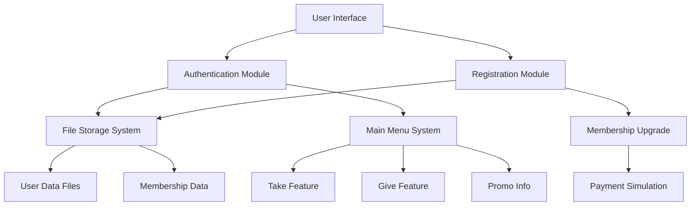

<div align="center">
  
<h1>🍽️ Em-Food User Authentication & Membership System </h1>
*A simple yet comprehensive console-based membership and authentication system for food service management*
</div>

---

<div align="center">


*This program was created to fulfill the final project for the Programming Language 1 subject at my university.*

</div>

---

## 📋 Table of Contents

- [Overview](#-overview)
- [Features](#-features)
- [System Architecture](#-system-architecture)
- [Application Flow](#-application-flow)
- [Project Structure](#-project-structure)
- [Getting Started](#-getting-started)
- [Usage Examples](#-usage-examples)
- [Technical Details](#-technical-details)

---

## 🎯 Overview

**Em-Food** is a Java-based console application that provides a complete user authentication and membership management system for a fictional food service. The system enables users to create accounts, authenticate securely, and access tiered membership benefits through an intuitive command-line interface.

### Key Capabilities
- ✅ **User Registration** - Secure sign-up process with validation
- ✅ **Authentication** - Login system with credential verification  
- ✅ **Membership Tiers** - Silver, Gold, and Platinum membership levels
- ✅ **Data Persistence** - File-based storage system
- ✅ **Promotional System** - Information and offers management

---

## ✨ Features

| Feature | Description |
|---------|-------------|
| 🔐 **Secure Registration** | Unique username and NPM validation with password requirements |
| 🎫 **Tiered Membership** | Three membership levels with different privileges and benefits |
| 📊 **Usage Tracking** | Monitor user activity and membership tier limitations |
| 💳 **Payment Simulation** | Mock payment system for premium membership upgrades |
| 📢 **Promo Management** | Display and manage promotional information |
| 💾 **Persistent Storage** | File-based data storage for user information |

---

## 🏗️ System Architecture



---

## 🔄 Application Flow

### Registration Process

```
┌─────────────────┐
│   Start App     │
└─────────┬───────┘
          │
          ▼
┌─────────────────┐
│  Choose Sign Up │
└─────────┬───────┘
          │
          ▼
┌─────────────────┐    ❌ Duplicate
│ Enter Username  │◄─────────┐
└─────────┬───────┘          │
          │ ✅ Unique        │
          ▼                  │
┌─────────────────┐          │
│ Validate & Save │──────────┘
└─────────┬───────┘
          │
          ▼
┌─────────────────┐    ❌ Invalid
│  Enter NPM      │◄─────────┐
│  (11 digits)    │          │
└─────────┬───────┘          │
          │ ✅ Valid         │
          ▼                  │
┌─────────────────┐          │
│ Validate & Save │──────────┘
└─────────┬───────┘
          │
          ▼
┌─────────────────┐    ❌ Too Short
│ Create Password │◄─────────┐
│  (Min 5 chars)  │          │
└─────────┬───────┘          │
          │ ✅ Valid         │
          ▼                  │
┌─────────────────┐          │
│ Validate & Save │──────────┘
└─────────┬───────┘
          │
          ▼
┌─────────────────┐
│ Choose Membership│
│ • Silver (Free) │
│ • Gold (Paid)   │
│ • Platinum (Paid)│
└─────────┬───────┘
          │
          ▼
┌─────────────────┐
│ Registration    │
│   Complete!     │
└─────────────────┘
```

### Login & Main Menu Flow

```
┌─────────────────┐
│ Choose Login    │
└─────────┬───────┘
          │
          ▼
┌─────────────────┐    ❌ Invalid
│ Enter Credentials│◄────────┐
│ • Username      │          │
│ • NPM           │          │
│ • Password      │          │
└─────────┬───────┘          │
          │ ✅ Valid         │
          ▼                  │
┌─────────────────┐          │
│ Authenticate    │──────────┘
└─────────┬───────┘
          │
          ▼
┌─────────────────┐
│   Main Menu     │
│ ┌─────────────┐ │
│ │    Take     │ │
│ │    Give     │ │
│ │ Promo Info  │ │
│ └─────────────┘ │
└─────────────────┘
```

---

## 📁 Project Structure

```
Em-Food-System/
├── 📄 Program.java          # Main application class
├── 📊 Data Files/
│   ├── 👤 Nama.txt         # User names storage
│   ├── 🆔 NPM.txt          # Student ID storage  
│   ├── 🔒 Password.txt     # Password storage
│   └── 👑 Royalty.txt      # Membership levels
└── 📖 README.md            # Project documentation
```

### File System Details

| File | Purpose | Format |
|------|---------|--------|
| `Nama.txt` | Stores registered usernames | Plain text, one per line |
| `NPM.txt` | Stores student IDs (NPM) | 11-digit numbers, one per line |
| `Password.txt` | Stores user passwords | Plain text, one per line |
| `Royalty.txt` | Stores membership tiers | Silver/Gold/Platinum, one per line |

---

## 🚀 Getting Started

### Prerequisites
- ☕ **Java 8** or higher
- 💻 **Command Line Interface**
- 📝 **Text Editor** (for viewing data files)

### Installation & Setup

1. **Clone or download** the project files
2. **Compile** the Java application:
   ```bash
   javac Program.java
   ```
3. **Run** the application:
   ```bash
   java Program
   ```

### First Run
The application will automatically create necessary data files (`Nama.txt`, `NPM.txt`, `Password.txt`, `Royalty.txt`) if they don't exist.

---

## 💡 Usage Examples

### Creating a New Account
```
Welcome to Em-Food System!
Choose an option:
1. Sign Up
2. Log In

> 1

Enter your name: john_doe
Enter NPM (11 digits): 12345678901
Enter password (min 5 characters): mypassword123

Choose membership level:
1. Silver (Free)
2. Gold ($10/month)
3. Platinum ($25/month)

> 2
Processing payment... ✅ Payment successful!
Registration complete! Welcome to Em-Food, john_doe!
```

### Logging In
```
Choose an option:
1. Sign Up
2. Log In

> 2

Enter your name: john_doe
Enter NPM: 12345678901
Enter password: mypassword123

✅ Login successful!
Membership Level: Gold

Main Menu:
1. Take
2. Give  
3. View Promotions
4. Exit
```

---

## 🔧 Technical Details

### Core Technologies
- **Language**: Java
- **I/O Operations**: BufferedReader, FileReader, PrintWriter
- **User Input**: Scanner, BufferedReader
- **Data Storage**: Plain text files

### Key Classes & Methods
- **`main()`** - Application entry point and main program loop
- **`royalty()`** - Handles membership upgrade logic and payment simulation
- **`promo()`** - Manages promotional information display and sorting

### Validation Rules
- **Username**: Must be unique across all registered users
- **NPM**: Exactly 11 digits, must be unique
- **Password**: Minimum 5 characters
- **Membership**: Silver (free), Gold/Platinum (paid with simulation)

---

<div align="center">

**Made with stress for learning Java development**

*Em-Food System*

</div>
